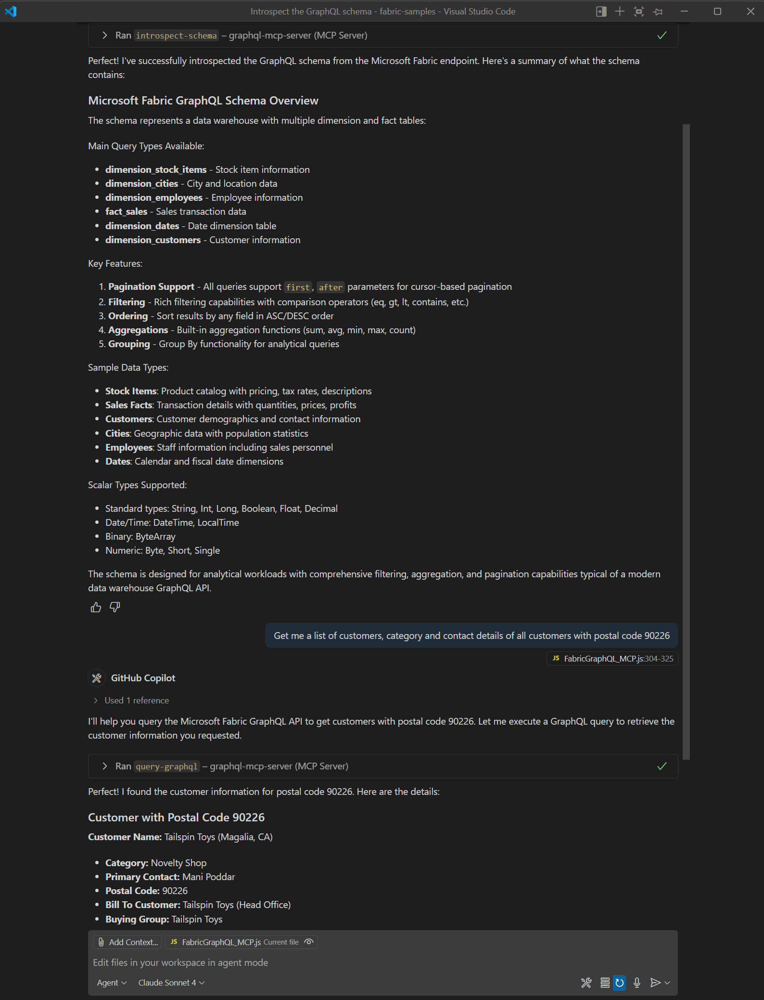

# 🔗 Microsoft Fabric GraphQL MCP Server

[](https://modelcontextprotocol.io/)
[](https://learn.microsoft.com/en-us/fabric/)
[](https://opensource.org/licenses/MIT)

A robust, enterprise-ready **Model Context Protocol (MCP)** server that bridges **Microsoft Fabric GraphQL APIs** to the AI ecosystem. This allows advanced LLM clients like Claude Desktop, Cursor, and GitHub Copilot to directly inspect database schemas and query your secure corporate data via natural language.

---

## ✨ Features

- **Seamless AI Integration**: Exposes your Microsoft Fabric data directly to AI assistants.
- **Enterprise Authentication**: Fully implements OAuth2 Client Credentials flow for secure, token-based access to Microsoft Entra ID.
- **Dynamic Introspection**: LLMs can self-discover your entire database schema in real-time.
- **Hybrid Transport Architecture**: Built on Express with Streamable HTTP, accompanied by battle-tested bash wrapper scripts for seamless `stdio` integration with Claude Desktop.
- **Protocol Compliant**: Handles JSON-RPC 2.0 cleanly, ensuring stability during long agentic coding sessions.

> 
>
> _Screenshot: Retrieving a list of customers using the introspected Microsoft Fabric GraphQL API schema in VSCode._

---

## 🌟 What Makes This Project Distinct?

1. **🏢 Unlocks Enterprise Data**: While most MCP servers target common developer tools (GitHub, local files), this project bridges the gap between secure, corporate data lakes (Microsoft Fabric) and local AI agents.
2. **🧠 "Teach a Man to Fish" Introspection**: Instead of hardcoding dozens of specific table queries, this server utilizes GraphQL Introspection. The LLM maps out the entire database schema dynamically on its first request, allowing it to write its own exact queries on the fly.
3. **🛡️ Abstracted Azure Authentication**: Authenticating with Microsoft Entra ID (Azure AD) is notoriously complex. This server natively handles the OAuth2 Client Credentials Flow, securely fetching, caching, and proactively refreshing Bearer tokens behind the scenes.
4. **🌉 Hybrid Transport Architecture**: Built on an Express HTTP server, but accompanied by a brilliant bash wrapper (`mcp-wrapper-fixed.sh`) that routes Node.js `stdout` to `stderr`. This allows it to act as a seamless `stdio` server for Claude Desktop while simultaneously accepting HTTP requests from tools like Cursor.

---

## 🚀 Quick Setup

### 1. Prerequisites

Before you begin, you must configure Service Principal access for your Microsoft Entra app and Fabric workspace. 
- Enable Service Principals in the Fabric Tenant Admin portal.
- **Introspection must be enabled**. By default, introspection is disabled in Fabric. A Workspace Admin must explicitly enable it. [Read the official documentation here.](https://learn.microsoft.com/en-us/fabric/data-engineering/api-graphql-introspection-schema-export)

### 2. Installation

Clone this repository and install the dependencies:

```bash
git clone https://github.com/yourusername/FabricGraphQL-MCP.git
cd FabricGraphQL-MCP
npm install
```

### 3. Environment Configuration

Create a `.env` file in the root directory (you can copy `.env.template`):

```env
MICROSOFT_FABRIC_API_URL=https://api.fabric.microsoft.com/v1/workspaces/your-workspace-id/items/your-item-id/execute
MICROSOFT_FABRIC_TENANT_ID=your_tenant_id_here
MICROSOFT_FABRIC_CLIENT_ID=your_client_id_here
MICROSOFT_FABRIC_CLIENT_SECRET=your_client_secret_here
SCOPE=https://api.fabric.microsoft.com/.default
```

---

## 💻 Connecting to AI Clients

### 🤖 Claude Desktop

To connect this server to Claude Desktop, you should use the provided wrapper script (`mcp-wrapper-fixed.sh`). This script cleanly pipes standard output to standard error, ensuring that console logs don't corrupt the JSON-RPC stream that Claude expects.

Edit your `claude_desktop_config.json` (usually located at `~/Library/Application Support/Claude/claude_desktop_config.json` on macOS):

```json
{
  "mcpServers": {
    "MicrosoftFabric": {
      "command": "/bin/bash",
      "args": [
        "/absolute/path/to/FabricGraphQL-MCP/mcp-wrapper-fixed.sh"
      ],
      "env": {
        "MICROSOFT_FABRIC_API_URL": "https://api.fabric.microsoft.com/v1/workspaces/...",
        "MICROSOFT_FABRIC_TENANT_ID": "...",
        "MICROSOFT_FABRIC_CLIENT_ID": "...",
        "MICROSOFT_FABRIC_CLIENT_SECRET": "...",
        "SCOPE": "https://api.fabric.microsoft.com/.default"
      }
    }
  }
}
```

### 💻 Cursor / GitHub Copilot

1. Run the Express server locally:
   ```bash
   node FabricGraphQL_MCP.js
   ```
2. Add the HTTP endpoint in your IDE's MCP tool settings:
   ```json
   "graphql-mcp-server": {
      "type": "http",
      "url": "http://localhost:3000/mcp"
    }
   ```
3. Prompt your AI: _"Use the introspect-schema tool, then show me all stock items with color, brand, and unit price."_

---

## 🛠️ Available MCP Tools

This server exposes the following tools to the LLM:

1. `introspect-schema`
   - **Description:** Retrieves the GraphQL schema from the Microsoft Fabric endpoint. The LLM must run this first to understand your data shape.
   - **Returns:** The full GraphQL schema as a JSON string.

2. `query-graphql`
   - **Description:** Executes a precise GraphQL query against the backend.
   - **Arguments:** 
     - `query` (string): The GraphQL query.
     - `variables` (object, optional): Variables for the query.

---

## 📝 License

This project is licensed under the MIT License.
